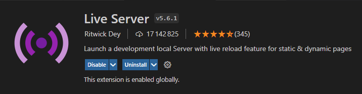
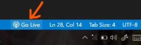

# Migration Map
Project for the Information Visualisation course, HES-SO Master, given by Prof. David Grunenwald

### Students

- Corentin Bompard
- Lucas Bueche

# Introduction

The goal of the project is to create a map representing the different migration flux of each countries, with colours ranging from red (high emigration), yellow (balanced migration) to green (high immigration). A colorblind is also available. The data spans the period 1990 to 2015.

Clicking on a country will show the country where most people emigrated to, and the country where people immigrated the most from.

# Installation

## Prerequisites

For development, you will need [Visual Studio Code](https://code.visualstudio.com/) installed.

You'll also need the "Live Server" extension of Visual Studio Code

## Project Installation

First, you'll need to clone this project 

<code> git clone https://github.com/lucasbueche/VI-migration-map.git</code>
  
# Running the project
  
Open the project in VSCode, open the index.html file, located in the app/html folder, and launch the server on the bottom right of the window.

Your browser will then automatically open a tab with the project, on localhost.
